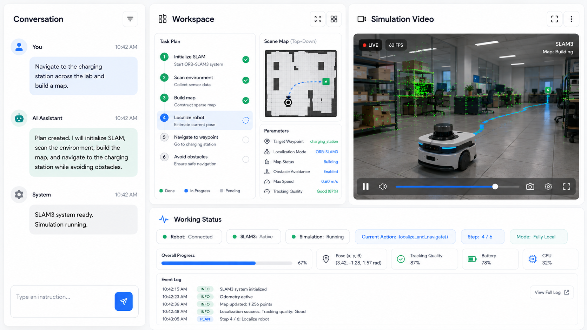
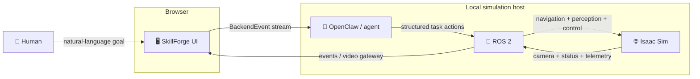

<div align="center">

# ⚒️ SkillForge

### Natural language → Physical AI → simulated robot

Give a robot a goal in plain English. Watch an agent turn that intent into structured actions, see ROS 2 and Isaac Sim execute the plan, and follow the robot through a live camera feed.

<p>
  <a href="https://github.com/homerquan/SkillForge"></a>
  <a href="https://react.dev/"></a>
  <a href="https://www.typescriptlang.org/"></a>
  <a href="https://docs.ros.org/en/jazzy/"></a>
  <a href="https://developer.nvidia.com/isaac/sim"></a>
</p>

<p>
  <strong>Fully local.</strong> <strong>Event-driven.</strong> <strong>Built for physical AI.</strong>
</p>

</div>

<p align="center">
  
</p>

## The idea

Robots are powerful, but their interfaces are still written for engineers. SkillForge is a hackathon-scale control surface for physical AI: a human describes the outcome, an agent produces an executable plan, and the robot reports what is actually happening.

```text
Human intent
     │  "Move to the table and pick up the blue box."
     ▼
SkillForge Web UI
     │  streaming conversation + structured actions
     ▼
OpenClaw / agent layer
     │  semantic intent → robot plan
     ▼
ROS 2
     │  navigation, perception, actuation, telemetry
     ▼
NVIDIA Isaac Sim
     │  Nova Carter + stereo cameras + warehouse scene
     ▼
Live state back to the browser
```

### What makes the demo compelling

| Capability | Why it matters |
| --- | --- |
| 💬 Natural-language control | Operators describe the job instead of hand-authoring motion primitives. |
| 🌊 Streaming event contract | Replies, actions, status changes, and camera frames arrive as one observable event stream. |
| 🤖 Robot visibility | The same interface shows the current action, run state, connection state, and camera feed. |
| 🧠 Mock-first development | The browser demo works before the real agent endpoint is available. |
| 🛰️ Real simulation path | Isaac Sim, ROS 2 Jazzy, stereo cameras, Visual SLAM, and optional Nav2/nvblox hooks are included. |
| 🔌 Clean integration seam | The UI depends on a small `Backend` interface, so the agent implementation can be swapped without rewriting components. |

## Current status: honest by design

SkillForge is deliberately split into a working demo path and integration seams for the next teammate:

- **Working now:** React + TypeScript UI, streaming mock assistant, structured action rendering, abort flow, status transitions, and generated live mock camera frames.
- **Working on the simulation host:** Isaac Sim Nova Carter warehouse scene, ROS 2 bridge, stereo camera topics, Isaac ROS Visual SLAM, optional Nav2/nvblox launch, and LAN MJPEG video.
- **Ready to connect:** `BackendEvent` and `Backend` contracts in `ui/src/lib/types.ts`.
- **Next integration:** implement `ui/src/lib/realBackend.ts` for the OpenClaw WebSocket and connect the ROS camera bridge to the browser event stream.

The UI intentionally labels the mock backend. A demo should never look live when it is running on fake data.

## Architecture



### The event contract

The UI does not depend on a particular agent SDK. It renders a stream of small, typed events:

```ts
type BackendEvent =
  | { type: "connection"; connected: boolean }
  | { type: "assistant_start"; id: string }
  | { type: "assistant_delta"; id: string; text: string }
  | { type: "assistant_end"; id: string }
  | { type: "action"; id: string; action: RobotAction }
  | { type: "status"; state: RunState; action?: RobotAction; detail?: string }
  | { type: "frame"; src: string }
  | { type: "error"; message: string };
```

The current UI action vocabulary is intentionally small:

```text
move()  rotate()  move_arm()  open_gripper()  close_gripper()
```

The semantic ROS 2 direction is documented in [`ROS2 Task Mapping.md`](ROS2%20Task%20Mapping.md): tasks such as `explore_area`, `search_for`, `inspect`, `detect_failure`, and `navigate_to` should express intent while ROS 2 owns the low-level control.

### Knowledge retrieval with MongoDB

SkillForge uses MongoDB to store and retrieve operational knowledge that the agent can use when planning tasks. For example, if the knowledge base identifies a box as fragile, the robot should avoid placing it at the bottom of a stack.

## Quick start — browser demo

The browser demo runs locally with mock data; no ROS 2, Isaac Sim, GPU, or backend endpoint is required.

```bash
cd ui
npm install
npm run dev
```

Open the local URL printed by Vite, then try:

> **Move to the table and pick up the blue box.**

You should see the assistant reply stream in, actions appear under the message, execution move through the status panel, and the mock camera continue animating.

Useful commands:

```bash
npm run build    # type-check and production build
npm run lint     # Oxlint
npm run preview  # preview the production build
```

### Point the UI at the simulation camera

The UI supports a direct camera URL through `VITE_CAMERA_URL`. For example, after starting the LAN video server on the simulation host:

```bash
VITE_CAMERA_URL="http://<simulation-host>:8080/stream?topic=/front_stereo_camera/left/image_raw&type=mjpeg&width=960&height=600&quality=80" \
  npm run dev
```

Keep `.env.local` private. Camera endpoints are intended for a trusted local network, not the public internet.

> **Note:** `VITE_OPENCLAW_URL` is reserved for the real backend integration. Until `realBackend.ts` exists, setting it intentionally fails loudly instead of silently showing mock data.

## Quick start — Isaac Sim + ROS 2

The simulation path is verified on an NVIDIA DGX Spark / supported Ubuntu host with:

| Requirement | Version |
| --- | --- |
| OS | Ubuntu 24.04 (Noble) |
| Architecture | `aarch64` on the verified DGX Spark setup |
| ROS 2 | Jazzy |
| Isaac ROS | 4.6 |
| Isaac Sim | 6.0.1 |
| CUDA | 13.0 |

Full installation instructions live in [`INSTALL.md`](INSTALL.md). Once the Isaac ROS workspace and Isaac Sim are installed:

```bash
cd sim
./start_sim.sh
```

The supervisor starts the Carter warehouse scene, waits for the stereo camera, launches Visual SLAM, optionally drives the robot, and opens a ROS image viewer.

Useful modes:

```bash
./start_sim.sh --no-viewer              # headless / SSH-friendly
./start_sim.sh --no-drive               # manual motion only
./start_sim.sh --no-viewer --no-drive   # minimal headless launch
./start_sim.sh --navigation             # nvblox + Nav2, if installed
```

Override default installation paths when needed:

```bash
ISAAC_SIM_ROOT=/path/to/isaacsim \
ISAAC_ROS_WS=/path/to/isaac_ros-dev \
  ./start_sim.sh
```

### Browser video from ROS 2

Install the ROS web video server once:

```bash
sudo apt install -y ros-jazzy-web-video-server
```

Then, while Isaac Sim is publishing:

```bash
./start_streaming_ros_video.sh
```

The script prints a LAN `stream_viewer` URL and a direct MJPEG URL suitable for an HTML `` element. See [`SIM_INTEGRATION.md`](SIM_INTEGRATION.md) for topics, troubleshooting, and the camera bridge design.

## Demo flow

```text
1. User types a goal
       ↓
2. Assistant streams a human-readable plan
       ↓
3. Structured actions appear inline in the conversation
       ↓
4. Robot status changes: thinking → executing → done
       ↓
5. Current action and camera feed update in real time
       ↓
6. Operator can abort from the same interface
```

The intended hackathon moment is:

> **“Move to the table and pick up the blue box.”**

The agent should translate that into a sequence such as `move`, `move_arm`, `close_gripper`, and `move_arm`, then expose each step as it executes.

## Repository map

```text
SkillForge/
├── ui/                         # React + TypeScript browser interface
│   └── src/
│       ├── components/         # Conversation and live robot panels
│       └── lib/                # Backend contract and mock event stream
├── sim/                        # Isaac Sim / ROS 2 launch and video scripts
├── design/mockup.png           # Product direction for the full workspace
├── SPEC.md                     # Original hackathon technical spec
├── ROS2 Task Mapping.md        # Semantic action → ROS 2 mapping
├── INSTALL.md                  # Isaac Sim and Isaac ROS installation
├── SIM_INTEGRATION.md          # Simulation, SLAM, and browser video notes
├── HANDOFF.md                  # Team handoff and endpoint integration notes
├── LLM.md                      # Local model endpoint notes
└── NOTE.md                     # Research note
```

## ROS 2 topics

The simulation publishes and consumes the following core interfaces:

| Topic | Role |
| --- | --- |
| `/front_stereo_camera/left/image_raw` | Left camera image and browser-facing video source |
| `/front_stereo_camera/right/image_raw` | Right camera image for stereo Visual SLAM |
| `/front_stereo_camera/*/camera_info` | Camera calibration |
| `/front_stereo_imu/imu` | IMU input |
| `/cmd_vel` | Carter velocity commands |
| `/visual_slam/tracking/odometry` | Visual SLAM odometry output |
| `/navigate_to_pose` | Nav2 navigation action when navigation mode is installed |

Inspect the running graph with:

```bash
ros2 topic list | grep visual_slam
ros2 topic hz /front_stereo_camera/left/image_raw
ros2 topic echo /visual_slam/tracking/odometry
```

## Roadmap

- [x] Two-panel browser UI
- [x] Streaming assistant response and typed backend event contract
- [x] Mock action execution with abort and status transitions
- [x] Generated mock camera frames for end-to-end UI development
- [x] Isaac Sim Nova Carter warehouse launch
- [x] Stereo camera topics and Isaac ROS Visual SLAM launch
- [x] LAN MJPEG camera server
- [ ] Implement the real OpenClaw WebSocket backend
- [ ] Bridge ROS image events directly into the browser event stream
- [ ] Replace primitive actions with semantic task actions
- [ ] Add unified map, telemetry, and event-log views from the design mockup
- [ ] Add task replay and run history

## Safety and scope

SkillForge is a local simulation prototype. The current browser backend is a mock, and the semantic ROS 2 adapter is still an integration target. Do not connect unreviewed agent output to physical hardware. The ROS video server binds to all interfaces by default; keep it on a trusted LAN or configure a restricted address before exposing it anywhere else.

## Team notes

The project is designed for parallel hackathon work:

- **Frontend:** build against the stable `Backend` interface.
- **Agent:** implement the OpenClaw endpoint without changing UI components.
- **Simulation:** keep Isaac Sim and ROS 2 launch details behind the existing scripts.
- **Integration:** connect the event stream and camera gateway once the endpoint shape is agreed.

See [`HANDOFF.md`](HANDOFF.md) for the full integration checklist and open API questions.

<div align="center">

### ⚒️ From intent to action — locally, visibly, and in real time.

</div>
